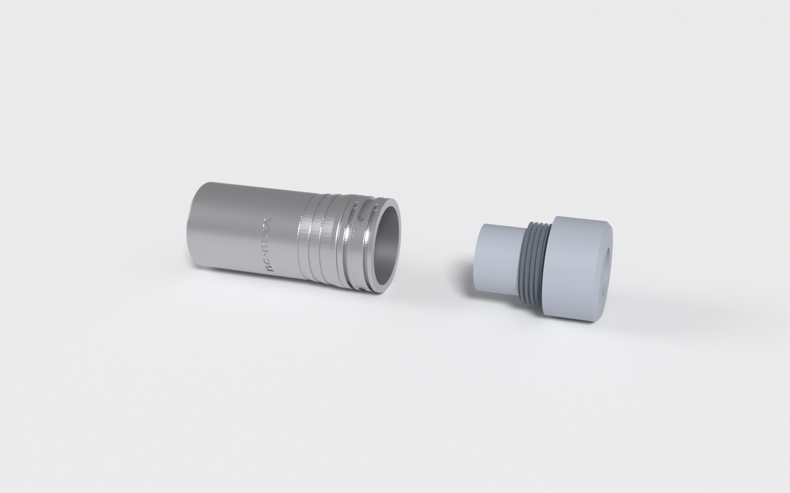
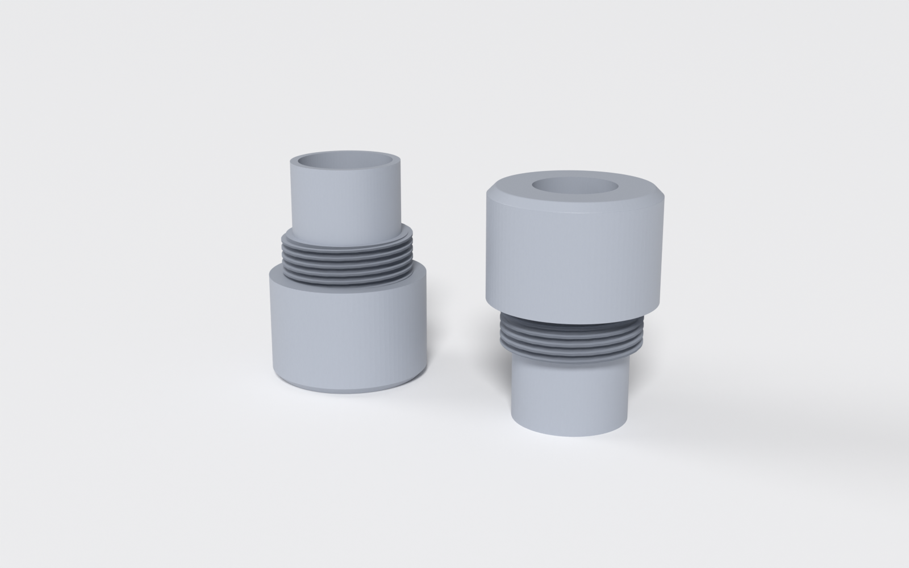
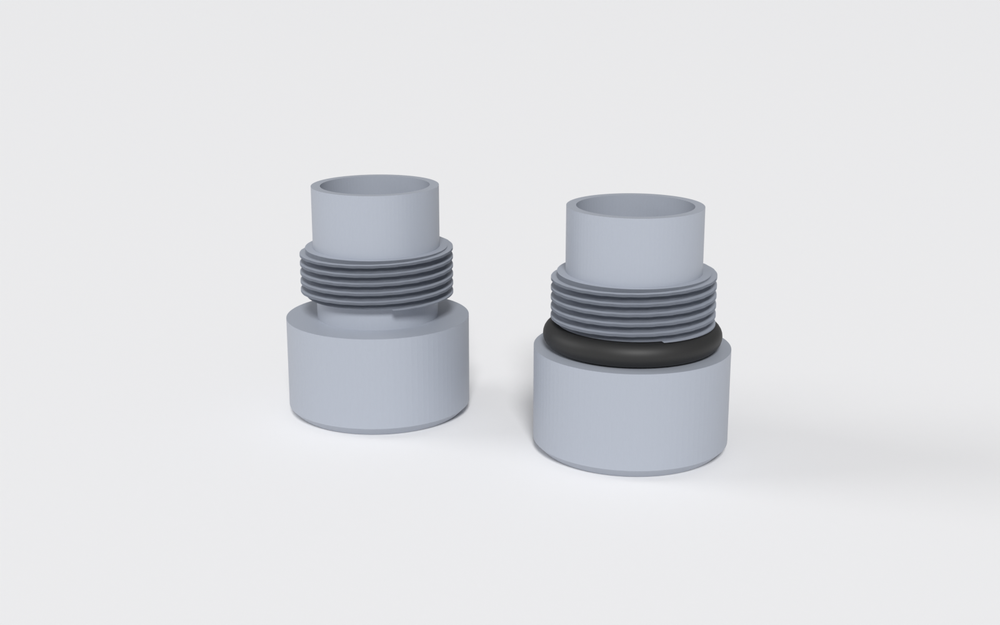
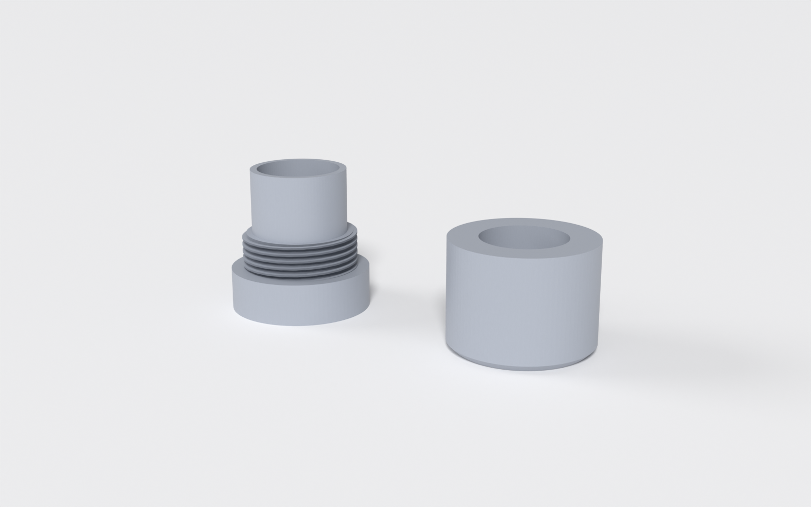

# AOM-5024 XLR pencil mic body

A one-piece, 3D-printable pencil-microphone body for the PUI Audio
**AOM-5024L-HD-R** electret capsule that screws directly into a genuine
Neutrik **NC3MXX** male XLR connector.

The design reuses the real connector's metal shell, pin insert and latch
unmodified - the printed part only replaces the cable bushing/boot, threading
into the shell's own internal thread and extending forward to carry the
capsule in a snug friction-fit pocket. Total length from capsule tip to the
connector's rear face is about **26 mm**, giving a very compact plug-on mic.



> **Compatibility warning:** this is designed for the NC3MXX exactly. That
> model has the bushing thread machined INSIDE the metal XLR shell. Older
> Neutrik revisions and the variants sold under the REAN brand have the
> thread on the OUTSIDE of the shell; those are NOT compatible with this
> design.

```
[capsule] [lip] [neck] [thread + wing ring] --> screws into --> [Neutrik NC3MXX]
                   one printed part                                   real connector
```



## Electronics

This body is designed for **simple P48 phantom-power circuitry - just a
resistor and a capacitor** - both of which fit inside the XLR connector
housing itself (on/around the pin insert's terminals). There is no PCB pocket
in the printed part and none is needed: the mic wires run from the insert
through the housing's 12 mm bore to the capsule's rear solder pads.

### Keep the cable short (about 20 m max)

The simple resistor + capacitor circuit is suitable for **short cable runs
only, roughly 20 meters at most**. Two reasons:

- **Cable capacitance rolls off the highs.** This circuit has no output
  buffer: the capsule's internal JFET drives the cable through the
  feed/coupling network, giving a source impedance of several kilohms.
  Together with the cable's conductor capacitance (roughly 50-100 pF per
  meter for typical mic cable) this forms an RC low-pass filter. At 20 m
  (about 2 nF) with a few-kilohm source, the corner sits just above the
  audio band; double or triple the length and the roll-off moves audibly
  into the treble, dulling the sound.
- **It is not a true balanced output.** The signal rides on one leg only, so
  the noise rejection of a genuinely balanced microphone is largely absent.
  The longer the run, the more hum and RF interference it picks up.

If you need a long run, either place the preamp/interface near the mic, or
upgrade the electronics to a buffered, impedance-balanced circuit (for
example a Schoeps- or Alice-style two-transistor front end) - though that
needs more board space than this connector housing offers.

## Weather sealing (optional)

The rear of the housing necks down to a narrow "seal zone" just behind the
collar. It works fine dry, but it also lets you weatherproof the joint between
the printed part and the metal shell with a single O-ring - handy for outdoor
mics.



The NC3MXX shell has a smooth, unthreaded lip pocket just inside its rear
opening, above the internal threads. Drop a **~13 x 2.5 mm** (inner diameter x
cord) O-ring into that pocket, then thread the housing in as usual: the seal
neck passes through the ring and the shell bore squeezes it against the neck,
sealing the joint. No groove or glue is needed - the ring is captured between
the shell and the housing.

This was tuned and print-tested against a real NC3MXX shell (neck Ø13.5 mm,
seal-zone length 2.6 mm). If your shell or O-ring differ, the seal zone is
parametric: adjust `oring_neck_d`, `oring_neck_len` and `oring_neck_bore_d`
under **[O-ring seal zone]**, then re-print `fit_test_conn_thread` (it carries
the seal neck) and check the fit in your shell before a full print.

The front acoustic port cannot be sealed - it has to stay open for the mic - so
this weatherproofs the rear joint and the electronics cavity, not the capsule
face.

## Bill of materials

- **Neutrik NC3MXX** male XLR connector - must have the bushing thread
  machined *inside* the shell (see the compatibility warning above)
- **PUI Audio AOM-5024L-HD-R** electret capsule (or another capsule - see
  [Adapting to your capsule](#adapting-to-your-capsule))
- Resistor + capacitor for the P48 circuit
- Thin wire; optionally a dab of hot glue for permanent capsule retention
- Optional: a **~13 x 2.5 mm** (ID x cord) O-ring to weather-seal the
  housing/shell joint (see [Weather sealing](#weather-sealing-optional))

## Print the fit tests first

The connector thread is print-tested in ASA with a 0.4 mm nozzle and works
perfectly, and the capsule pocket is snug enough to hold the AOM-5024 in
place with friction alone (a small dab of hot glue would not hurt). Shells,
capsules, printers and materials vary, though, so both coupons are the cheap
way to confirm on your setup - they are tiny and print in minutes:

| coupon | verifies |
|---|---|
| `stl/fit_test_conn_thread.stl` | rear thread screws smoothly into *your* shell, and the wing ring reaches/pushes the pin insert into its seat |
| `stl/fit_test_capsule.stl` | front tip only - the capsule slides in snug and seats flat on the internal lip |



If the thread binds, reduce `conn_thread_major_d` ~0.1-0.2 mm at a time. If
the capsule is too tight in the pocket, raise `capsule_radial_clear` a step
(0.05 to 0.10); if it is loose, your capsule may be undersized - measure it
and set `capsule_od` to match.

## Printing

The design is print-verified: ASA with a 0.4 mm nozzle (Bambu Lab H2D) came
out right on the first try.

- **Material:** PETG, ABS or ASA (thread and wing-ring durability)
- **Layer height:** 0.16-0.20 mm, **perimeters:** 4
- **Infill:** 15 % is plenty; the part is mostly walls
- **Orientation:** front (capsule) end **down** on the bed, wing ring up.
  This matters: the tip chamfer is shaped to be self-supporting in this
  orientation. The internal lip prints as a narrow overhang step; it needs
  no support.

## Adapting to your capsule

Open `aom5024_xlr_mic.scad` in OpenSCAD - the parameters are organized for
the built-in Customizer (Window → Customizer). The pocket bore, pocket depth
and lip position all derive from two numbers under **[Capsule]**:

| parameter | default | meaning |
|---|---|---|
| `capsule_od` | 9.8 | capsule body **diameter** - measure yours with calipers (the AOM-5024 datasheet says 9.7 mm, an actual unit measured 9.8 mm) |
| `capsule_h` | 5.0 | capsule body **height/depth**, front face to rear face |
| `capsule_radial_clear` | 0.05 | extra pocket radius per side - a snug slip fit |
| `capsule_depth_clear` | 0.2 | extra pocket depth for height variation / solder blobs |

Other things you may want to tweak:

| parameter | default | meaning |
|---|---|---|
| `body_len` | 2.5 | neck length between capsule section and connector - raise for a longer mic body; nothing else depends on it |
| `lip_overlap` | 0.6 | how far the retaining lip steps in below `capsule_od`. The lip opening (`capsule_od` minus this, 9.2 mm at defaults) is what the wires pass through - wide and easy |
| `lip_len` | 1.5 | axial thickness of the lip ring |

Guardrail `assert()`s fail the render loudly if a parameter combination
produces an oversized or broken part. After any change, print
`fit_test_capsule.stl` before a full housing.

## Exporting STLs

```
openscad -o stl/housing.stl              -D 'part="housing"'              aom5024_xlr_mic.scad
openscad -o stl/fit_test_conn_thread.stl -D 'part="fit_test_conn_thread"' aom5024_xlr_mic.scad
openscad -o stl/fit_test_capsule.stl     -D 'part="fit_test_capsule"'     aom5024_xlr_mic.scad
```

Pre-rendered STLs with the default parameters are included in `stl/`.

## Assembly

1. Solder the P48 resistor/capacitor circuit on the XLR pin insert's
   terminals, with the two mic wires attached.
2. Feed the mic wires through the printed housing (rear opening → out the
   front).
3. Solder the wires to the capsule's rear pads.
4. Pull the wire slack back while pushing the capsule into the front pocket,
   until its rear face seats flat on the internal lip. Friction holds
   it; a small dab of hot glue makes it permanent.
5. Optional weather seal: drop a ~13 x 2.5 mm (ID x cord) O-ring into the
   connector shell's smooth internal lip pocket, just inside the rear opening
   above the threads (see [Weather sealing](#weather-sealing-optional)).
6. Screw the housing into the connector shell. The wing ring pushes the pin
   insert into its seat as the thread tightens; if fitted, the seal neck passes
   through the O-ring and the shell squeezes it home.

## Design notes

Dimensional provenance and the reasoning behind the geometry live in
[SPEC.md](SPEC.md). The preview images are rendered from the STLs with
`scripts/render_previews.py` (Blender, headless).

## License

[CC BY-NC 4.0](LICENSE) (Creative Commons Attribution-NonCommercial).
You are free to print, modify and share this design with attribution.
**Commercial use is not permitted** - do not sell prints or derivatives of
this design.
